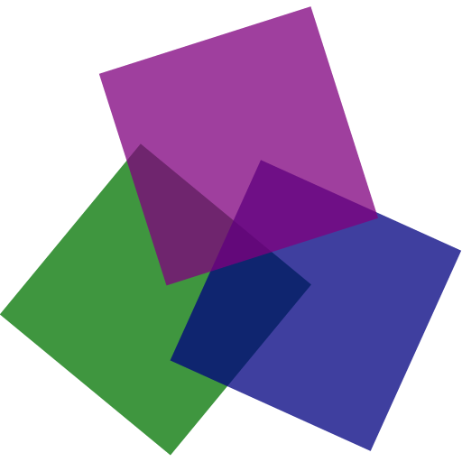

    

<h1 align="center">DUCLOS  An Offline AI Imagery App.</h1>

    
    
    

Duclos is an app that can run a AI model that can also read images from the users gallery or camera.

What the user can do

- Create Chats with the AI.
- Give the AI text and images.
- Pre-prompt to define who the AI is.
- Enable AI to re-read past messages with timestamps.
- Disable app coded-in system level pre-prompted commands.

---

### HARDWARE RECOMMENDATIONS
- **ANDROID ONLY** (ios isn't planned to be supported.)
- 6GB of storage.
- 8GB of RAM.

---

### PREVIEW

  

 

---

### NOTES

You need wifi to download both the AI Model and the AI's MMPROJ file.

In the app, it's recommended to change your settings immediately, because it's pre-prompted to behave like a hosted-LLM.

The AI model that was used is [Qwen2.5-VL-7B-Instruct-UD-Q2_K_XL](https://huggingface.co/unsloth/Qwen2.5-VL-7B-Instruct-GGUF). (Custom AI Models are planned.)

Duclos was built in React Native with a Expo Framework.

---

    

---
